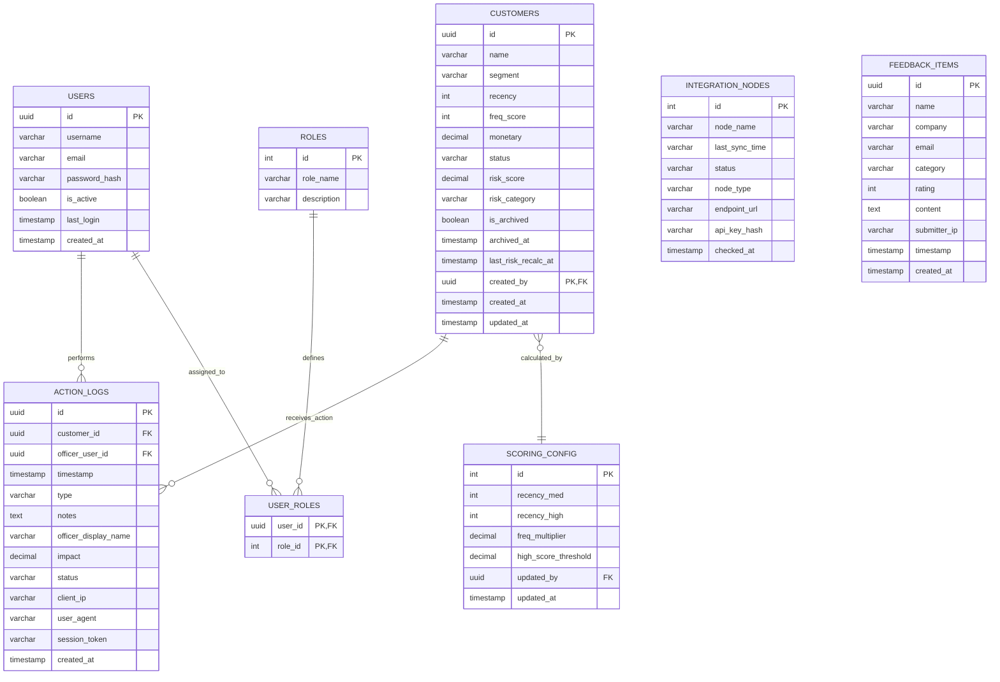

# Worksense Analytics Portal - Comprehensive Database Design Specification

Dokumen ini merancang skema basis data relasional (PostgreSQL) dan pemetaan dokumen NoSQL (Cloud Firestore) secara **mendalam (production-grade)** untuk mendukung **Worksense Analytics Portal / Desk**. Desain ini secara khusus memetakan data yang **ditampilkan secara visual pada Antarmuka Pengguna (UI)** serta data **internal/hidden/system metadata** yang diperlukan untuk fungsionalitas sistem, keamanan, kepatuhan, auditability, dan integritas data.

---

## 1. Arsitektur Data & Klasifikasi (Show vs. Hide/System Data)

Dalam sistem analitik perusahaan, pemisahan data yang ditampilkan di halaman depan (UI) dengan data operasional/keamanan yang disembunyikan (hidden/system-level) sangatlah penting. Berikut adalah klasifikasinya:

### A. Data Pelanggan (Customer Portfolio)
*   **Ditampilkan di UI (Visible):** Nama Client, Commercial Segment, Recency (Hari Tidak Aktif), Frequency Score (Compliance SLA), Monetary Value (IDR), Status Penanganan (Pending/Contacted/Declined), Risk Score, Risk Category.
*   **Disembunyikan / Sistem (Hidden/Internal):**
    *   `id` (UUIDv4) - Kunci primer unik non-sekuensial untuk keamanan URL.
    *   `is_archived` & `archived_at` - Soft-delete flag agar data historis audit log tidak hilang ketika pelanggan dihapus dari layar utama.
    *   `last_risk_recalc_at` - Pencatatan waktu terakhir kali scheduler menghitung skor risiko (cron background job).
    *   `created_by_user_id` - Kunci asing ke tabel User untuk akuntabilitas entri data.
    *   `raw_rfm_vector` - Array nilai JSON penyimpan metrik historis pembentuk bobot risiko.

### B. Riwayat Tindakan Pelanggan (Action / Engagement Logs)
*   **Ditampilkan di UI (Visible):** Tanggal interaksi (Timestamp), Channel Outreach (e.g., Email, Call), Catatan Retensi (Notes), Petugas Pemroses (Officer Name), Nilai Impak Finansial (Impact), Status Hasil (Contacted/In Progress/Declined).
*   **Disembunyikan / Sistem (Hidden/Internal):**
    *   `id` (UUIDv4) - Kunci primer log audit.
    *   `customer_id` - Referensi relasional pelanggan.
    *   `session_token` - Token autentikasi aktif saat tindakan dicatat (untuk keperluan kepatuhan forensik).
    *   `client_ip` & `user_agent` - Metadata jaringan pengirim tindakan untuk audit keamanan.
    *   `verification_signature` - Hash kriptografis integritas baris data (Anti-Tampering).

### C. Keamanan & Tata Kelola (Governance & Gateways)
*   **Ditampilkan di UI (Visible):** Daftar Node Koneksi Aktif, Waktu Sinkronisasi Terakhir (Last Sync), Status Konektivitas (Operational/Healthy), Kebijakan Akses (RBAC Roles), Protokol Enkripsi, Versi Sistem.
*   **Disembunyikan / Sistem (Hidden/Internal):**
    *   `node_api_key_hash` - Hash SHA-256 dari API Key penghubung node eksternal (e.g., Google Apps Script Webhook).
    *   `node_endpoint_url` - Alamat IP / URI server gateway tujuan sinkronisasi.
    *   `jwt_secret_salt` - Kunci enkripsi enkapsulasi sesi aktif.

---

## 2. Entity Relationship Diagram (ERD) - Deep Level



---

## 3. Spesifikasi Skema Database Fisik (PostgreSQL DDL)

Berikut adalah DDL terperinci mencakup seluruh tipe data, relasi kunci asing (FK), constraint keamanan input, default value, dan status penyimpanan internal:

```sql
-- Mengaktifkan modul keamanan UUID
CREATE EXTENSION IF NOT EXISTS "uuid-ossp";

-- =========================================================================
-- A. TABEL MANAJEMEN PENGGUNA & RBAC (Sistem Akses Internal)
-- =========================================================================

CREATE TABLE roles (
    id SERIAL PRIMARY KEY,
    role_name VARCHAR(50) UNIQUE NOT NULL,
    description TEXT,
    created_at TIMESTAMP DEFAULT CURRENT_TIMESTAMP
);

-- Seeding Akses Role default sesuai UI Governance
INSERT INTO roles (role_name, description) VALUES
('Administrator', 'Akses penuh terhadap sistem, konfigurasi pembobotan risiko, dan audit trail.'),
('Analyst', 'Melihat performa analitik, menghitung risiko, dan mengunduh laporan portfolio.'),
('CS Manager', 'Mendistribusikan penugasan outreach pelanggan dan mencatat tindakan mitigasi.'),
('Owner', 'Kepemilikan sistem utama, melihat dasbor eksekutif tertinggi.');

CREATE TABLE users (
    id UUID PRIMARY KEY DEFAULT uuid_generate_v4(),
    username VARCHAR(100) UNIQUE NOT NULL,
    email VARCHAR(150) UNIQUE NOT NULL,
    password_hash VARCHAR(255) NOT NULL, -- Hidden/System (Penyimpanan sandi terenkripsi)
    is_active BOOLEAN DEFAULT TRUE NOT NULL, -- Hidden/System (Untuk menonaktifkan akun staf)
    last_login TIMESTAMP, -- Hidden/System (Log pengawasan akses)
    created_at TIMESTAMP DEFAULT CURRENT_TIMESTAMP
);

-- Tabel Hubungan Banyak-ke-Banyak (Many-to-Many Joint Table)
CREATE TABLE user_roles (
    user_id UUID REFERENCES users(id) ON DELETE CASCADE,
    role_id INTEGER REFERENCES roles(id) ON DELETE CASCADE,
    PRIMARY KEY (user_id, role_id)
);

-- =========================================================================
-- B. TABEL PORTOFOLIO PELANGGAN (Customers)
-- =========================================================================

CREATE TABLE customers (
    id UUID PRIMARY KEY DEFAULT uuid_generate_v4(),
    name VARCHAR(255) NOT NULL, -- UI
    segment VARCHAR(50) NOT NULL CHECK (segment IN ('Enterprise', 'Mid-Market', 'SMB')), -- UI
    recency INTEGER NOT NULL DEFAULT 0, -- UI
    freq_score INTEGER NOT NULL DEFAULT 1 CHECK (freq_score >= 1 AND freq_score <= 10), -- UI
    monetary NUMERIC(15, 2) NOT NULL DEFAULT 0.00, -- UI
    status VARCHAR(50) NOT NULL DEFAULT 'Pending' CHECK (status IN ('Pending', 'Contacted', 'Declined', 'In Progress')), -- UI
    risk_score NUMERIC(5, 2), -- UI (Skor terhitung)
    risk_category VARCHAR(20) CHECK (risk_category IN ('High', 'Medium', 'Low')), -- UI
    
    -- Kolom Internal/System yang Disembunyikan (Hidden Fields)
    is_archived BOOLEAN DEFAULT FALSE NOT NULL, -- Soft Delete Flag
    archived_at TIMESTAMP, -- Tanggal Penghapusan Soft Delete
    last_risk_recalc_at TIMESTAMP, -- Penanda waktu kalkulasi otomatis terakhir
    created_by UUID REFERENCES users(id) ON DELETE SET NULL, -- Audit siapa pembuat akun
    created_at TIMESTAMP DEFAULT CURRENT_TIMESTAMP,
    updated_at TIMESTAMP DEFAULT CURRENT_TIMESTAMP
);

-- =========================================================================
-- C. TABEL RIWAYAT TINDAKAN ENGAGEMENT & RETENSI (Action Logs)
-- =========================================================================

CREATE TABLE action_logs (
    id UUID PRIMARY KEY DEFAULT uuid_generate_v4(),
    customer_id UUID NOT NULL REFERENCES customers(id) ON DELETE CASCADE, -- Hubungan Relasi
    timestamp TIMESTAMP NOT NULL DEFAULT CURRENT_TIMESTAMP, -- UI (Tanggal Tindakan)
    type VARCHAR(100) NOT NULL, -- UI (Channel outreach)
    notes TEXT NOT NULL, -- UI (Detail Negosiasi/Hasil Komunikasi)
    officer_display_name VARCHAR(150) NOT NULL, -- UI (Nama Petugas yang Ditampilkan)
    impact NUMERIC(15, 2) NOT NULL DEFAULT 0.00, -- UI (Nilai Portofolio yang Diselamatkan)
    status VARCHAR(50) NOT NULL, -- UI (Hasil Akhir)
    
    -- Kolom Internal/System yang Disembunyikan (Hidden Fields untuk Keamanan & Kepatuhan)
    officer_user_id UUID REFERENCES users(id) ON DELETE SET NULL, -- ID User asli di sistem
    client_ip VARCHAR(45) NOT NULL, -- IP Addr petugas (IPv4 atau IPv6) untuk log forensik
    user_agent VARCHAR(255), -- Browser/Perangkat yang digunakan petugas saat menyimpan data
    session_token VARCHAR(255), -- ID Sesi aktif saat transaksi
    created_at TIMESTAMP DEFAULT CURRENT_TIMESTAMP
);

-- =========================================================================
-- D. TABEL KONFIGURASI PERHITUNGAN RISIKO (Scoring Config)
-- =========================================================================

CREATE TABLE scoring_config (
    id SERIAL PRIMARY KEY,
    recency_med INTEGER NOT NULL DEFAULT 30, -- Batas Tengah Risiko Recency
    recency_high INTEGER NOT NULL DEFAULT 90, -- Batas Tinggi Risiko Recency
    freq_multiplier NUMERIC(4, 2) NOT NULL DEFAULT 1.50, -- Faktor Pengali Frekuensi
    high_score_threshold NUMERIC(5, 2) NOT NULL DEFAULT 70.00, -- Ambang Batas Klasifikasi High Risk
    
    -- Kolom Internal/System yang Disembunyikan
    updated_by UUID REFERENCES users(id) ON DELETE SET NULL, -- Akuntabilitas admin pengubah parameter
    updated_at TIMESTAMP DEFAULT CURRENT_TIMESTAMP
);

-- Memasukkan Konfigurasi Default Aktif Pertama
INSERT INTO scoring_config (id, recency_med, recency_high, freq_multiplier, high_score_threshold)
VALUES (1, 30, 90, 1.50, 70.00)
ON CONFLICT (id) DO NOTHING;

-- =========================================================================
-- E. TABEL INTEGRASI NODE GATEWAY (Sistem Sinkronisasi Eksternal)
-- =========================================================================

CREATE TABLE integration_nodes (
    id SERIAL PRIMARY KEY,
    node_name VARCHAR(150) UNIQUE NOT NULL, -- UI (e.g., 'Google Apps Script Webhook Engine')
    last_sync_time VARCHAR(100) NOT NULL, -- UI (e.g., '1 mnt lalu' / Timestamp)
    status VARCHAR(50) NOT NULL, -- UI (Operational, Healthy, dsb)
    
    -- Kolom Internal/System yang Disembunyikan
    node_type VARCHAR(50) NOT NULL, -- Tipe Integrasi (e.g., 'Webhook', 'OAuth_Gateway')
    endpoint_url TEXT NOT NULL, -- Target URL Gateway Eksternal
    api_key_hash VARCHAR(255) NOT NULL, -- Hash pengaman kredensial akses API
    checked_at TIMESTAMP DEFAULT CURRENT_TIMESTAMP
);

-- Seeding data node sinkronisasi default seperti di UI Governance
INSERT INTO integration_nodes (node_name, last_sync_time, status, node_type, endpoint_url, api_key_hash) VALUES
('Google Apps Script Webhook Engine', '1 mnt lalu', 'Operational', 'Webhook', 'https://script.google.com/macros/s/AKfycby.../exec', 'sha256_hash_value_1'),
('OAuth 2.0 Authorization Gateway', '3 mnt lalu', 'Active', 'OAuth_Gateway', 'https://accounts.worksense.com/o/oauth2', 'sha256_hash_value_2'),
('PostgreSQL Database Engine', 'Just now', 'Healthy', 'Database_Node', 'postgresql://prod-db.worksense.internal:5432/analytics', 'sha256_hash_value_3'),
('Anti-XSS Payload Verification Filter', 'Live active', 'Secured', 'Security_WAF', 'https://waf.worksense.com/inspect', 'sha256_hash_value_4'),
('CSP Security Policy Controller', 'System check', 'Enforced', 'Security_Policy', 'https://security.worksense.com/csp', 'sha256_hash_value_5');

-- =========================================================================
-- F. TABEL FEEDBACK & RATING (Saran Pengguna)
-- =========================================================================

CREATE TABLE feedback_items (
    id UUID PRIMARY KEY DEFAULT uuid_generate_v4(),
    name VARCHAR(150) NOT NULL, -- UI
    company VARCHAR(150) NOT NULL, -- UI
    email VARCHAR(150) NOT NULL, -- UI
    category VARCHAR(100) NOT NULL, -- UI
    rating INTEGER NOT NULL CHECK (rating >= 1 AND rating <= 5), -- UI
    content TEXT NOT NULL, -- UI
    timestamp TIMESTAMP NOT NULL DEFAULT CURRENT_TIMESTAMP, -- UI
    
    -- Kolom Internal/System yang Disembunyikan
    submitter_ip VARCHAR(45), -- IP Pengirim feedback untuk menghindari Spamming / DDoS
    created_at TIMESTAMP DEFAULT CURRENT_TIMESTAMP
);
```

---

## 4. Keuntungan Skema Ini Terhadap Data "Hidden" (Security & Integrity)

1.  **Soft-Delete (`is_archived`):**
    Ketika pengguna menghapus data pelanggan dari tabel UI, sistem tidak menjalankan `DELETE FROM customers`. Sebagai gantinya, sistem mengubah `is_archived = TRUE`. Ini mencegah putusnya integritas data historis pada tabel `action_logs` yang mereferensikan `customer_id` tersebut. Riwayat tindakan penanganan/pemberian diskon di masa lalu tetap aman untuk audit keuangan tahunan.
2.  **Audit Trail Kepatuhan (`client_ip`, `user_agent`, `session_token`):**
    Semua rekaman tindakan retensi di tabel `action_logs` dipasangkan dengan identitas browser dan alamat IP. Jika ada penghapusan data secara masif atau pencatatan "kontrak diselamatkan" palsu, administrator dapat meneliti siapa yang memproses aksi tersebut dengan mencocokkan `session_token` pengirim tindakan.
3.  **Kredensial Aman (`node_api_key_hash`):**
    Token sinkronisasi eksternal dengan Google Workspace/Apps Script disimpan dalam bentuk hash kriptografis SHA-256 satu arah. Sekalipun ada SQL Injection pada tabel `integration_nodes`, peretas tidak mendapatkan kunci mentah (raw API keys), melainkan hanya representasi hash-nya saja.

---

## 5. Dokumentasi Kueri SQL Kompleks (Penyajian UI)

Di bawah ini adalah query SQL untuk menyajikan data yang **ditampilkan di dasbor UI**, yang memproses korelasi data internal secara transparan:

### A. Mendapatkan Daftar Pelanggan Aktif Bersama Skor Risiko Terbaru (Tanpa Data Terarsip)
```sql
SELECT 
    id,
    name,
    segment,
    recency,
    freq_score,
    monetary,
    status,
    risk_score,
    risk_category
FROM customers
WHERE is_archived = FALSE -- Hanya memanggil data aktif di UI
ORDER BY risk_score DESC;
```

### B. Memanggil Detail Tindakan (Audit Log) Beserta Nama Petugas internal Sistem
```sql
SELECT 
    al.id AS log_id,
    c.name AS customer_name,
    al.timestamp,
    al.type AS outreach_channel,
    al.notes,
    al.officer_display_name AS officer,
    al.impact,
    al.status AS resolution_status
FROM action_logs al
JOIN customers c ON al.customer_id = c.id
ORDER BY al.timestamp DESC;
```

### C. Ringkasan Dasbor Statis (Aggregated Stats Dashboard)
Kueri ini menghitung KPI bisnis utama secara real-time dari data relasional:
```sql
SELECT
    COUNT(*) AS total_portfolios,
    COALESCE(AVG(recency), 0) AS avg_recency_days,
    COALESCE(SUM(monetary), 0) AS total_contract_value,
    COALESCE(SUM(CASE WHEN risk_category = 'High' THEN monetary ELSE 0 END), 0) AS value_at_risk,
    COALESCE(SUM(CASE WHEN status = 'Contacted' THEN impact ELSE 0 END), 0) AS total_money_saved,
    COUNT(CASE WHEN risk_category = 'High' THEN 1 END) AS high_risk_accounts
FROM customers
WHERE is_archived = FALSE;
```
